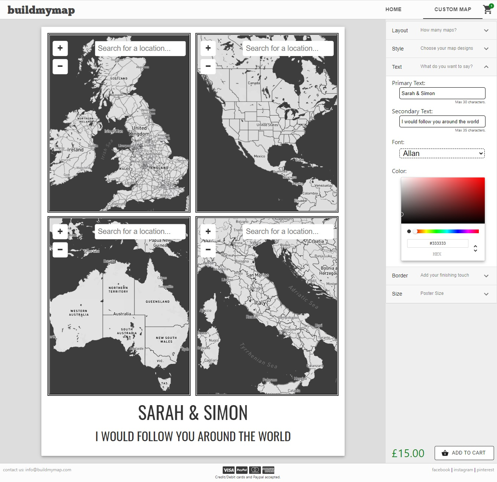

#### About Build My Map
BuildMyMap is a personal project to create a customisable map-poster building service.

#### It utilises or integrates with the following technologies:

- React - Building of front end
- Redux - Storing the state of current poster design and shopping cart
- NodeJs - Handling backend API logic, and interacting with MongoDB, and Mapbox
- Express - Setting up APIs on node backend
- MaterialUI - component library
- Paypal - paybal button & API integration
- OpenLayers - Displaying and navigating map
- MapBox - Storing map designs, requesting Web Map Tiles, using GeoCoding API to get coordinates of locations
- MongoDB - Storing users order details

### `npm start`

Runs the app in the development mode. 
Open [http://localhost:3000](http://localhost:3000) to view it in the browser.

The page will reload if you make edits. 
